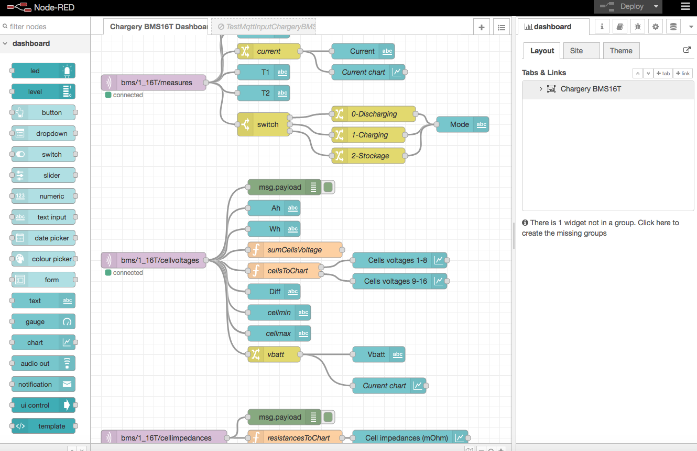
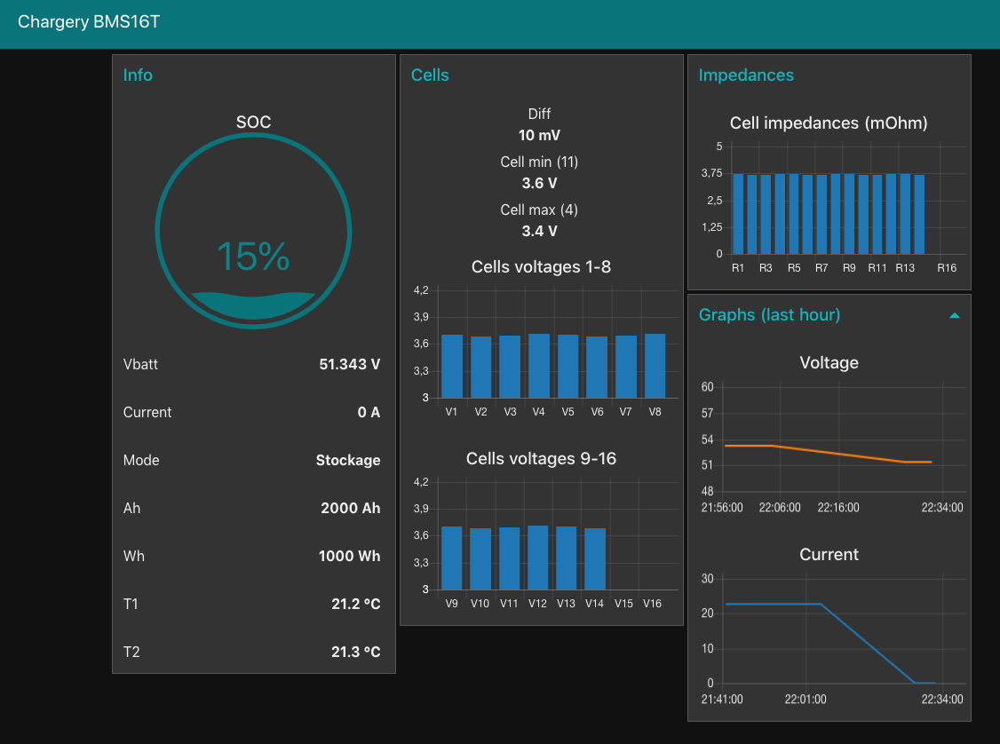
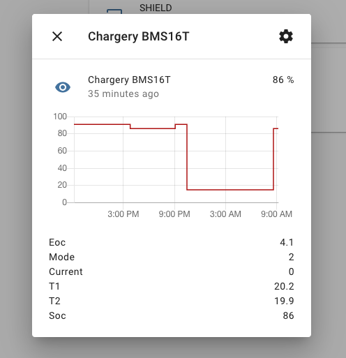

mqtt-chargerybms
MQTT Client for Chargery BMS

Extracts frames from Chargery BMS (protocol v1.25) and converts them into messages published to a mqqt broker. Messages are published in three topics (each topic corresponding to a frame in bms protocol) :

* bms/1_16T/measures
* bms/1_16T/cellvoltages
* bms/1_16T/cellimpedances

Some data is calculated from the data received and added to messages : 
* vbatt: the sum of the cells voltages 
* diffmv: the voltage difference between max cell voltage and min cell voltage 
* index of cell with min voltage 
* index of cell with max voltage

(for accurate calculation of diffmv and index min and max of cells, you need to specifify in code the total number of wired cells of your battery to the bms)

The code is for an ESP32:

* connected to a serial ttl<->rs232 converter, ttl side of the converter on pin 16 (serial2) of esp32 and rx side of rs232 to tx of chargery. (cannot use invert logic on serial port of esp32 so converter needed, succeed in arduino uno with softwareserial and inverted logic)
* connected to a server broker (mosquitto) on wifi.

Extras:

* Dashboard created node-red with a dashboard flow to visualize the incoming messages and a test flow to simulate mqqt messages output without using esp32.
* How to run the dashboard and the mqqt broker on android with termux.
* Example of sensor definition in home assistant

Software used:

* PlatformIO in visual studio code (alternatively can use arduino ide.)
* Mosquitto MQTT broker
* node-red for making dashboard

Hardware used:

* ESP32-DevKitC V4 (partition schema changed to have enough space for: ota-firmware update via wifi- and bluetooth-serial input test-)
* CP2102 USB to TTL 6-in-1 Multi-Function Serial Port Module Converter (USB-TTL, USB-232, USB-485, TTL-232, TTL-485, 232-485) for its versatility.
* Powerbank with two usb outputs (one for powering esp32 and one for powering TTL-232 converter)
* Two dupont cables female-female to hook the converter to the esp32.

Extras:

* Node red flows (dashboard and mqtt inject test data, still need mqtt broker):


 [Download Code of flows](/medias/flows.json)

* Home assistant

After enabling mqtt in file configuration.yaml of home-assistant, add for example in the same file this sensor and map it to a :
```javascript
sensor:  
  - platform: mqtt
    name: "Soc"
    state_topic: "bms/1_16T/measures"
    name: "Chargery BMS16T"
    unique_id: "1_16T"
    unit_of_measurement: '%'
    value_template: "{{ value_json.soc }}"
    json_attributes_topic: "bms/1_16T/measures"
```

You will obtain simply this in dashboard:

